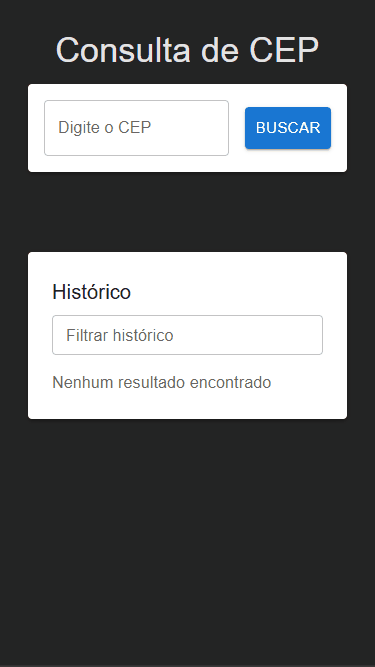
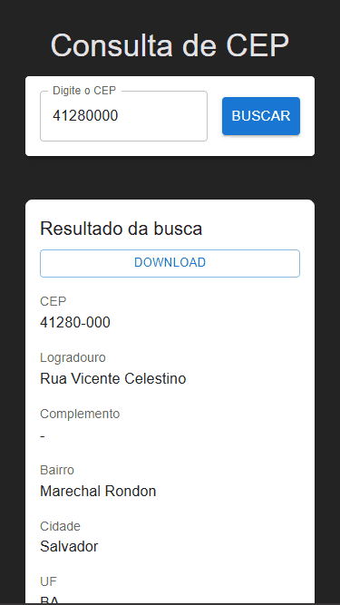
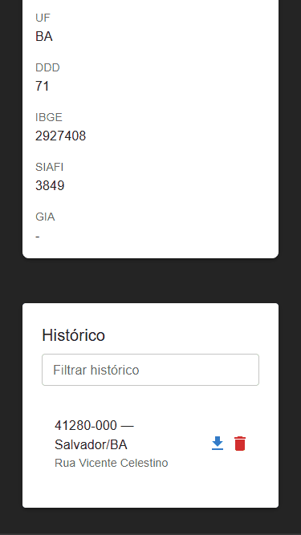

# Via CEP App

Um aplicativo React moderno para consultar CEPs brasileiros, exibir resultados detalhados e gerenciar histórico de buscas, com download em TXT e PDF.

---

## 🎯 Funcionalidades

- 🔍 Consulta de CEP via API [ViaCEP](https://viacep.com.br/)
- 📋 Exibição completa do endereço:
  - Logradouro, Bairro, Cidade, UF
  - DDD, IBGE, SIAFI, GIA
- 📜 Histórico de CEPs pesquisados:
  - Filtro por CEP, logradouro ou cidade
  - Paginação
  - Botões de **download (TXT/PDF)** e **exclusão**
- 💾 Download do resultado da busca em **TXT** ou **PDF**
- 📱 Layout responsivo: desktop e mobile
- ⚠️ Validação de CEP digitado

---

## 💻 Screenshots / GIFs

### Tela de busca e resultado



### Histórico com botões de download e exclusão



### Modal de detalhes com download TXT/PDF




---

## 🛠 Tecnologias

- React 18 + TypeScript
- Material-UI (MUI) para componentes e layout
- jsPDF para geração de PDFs
- CSS-in-JS (`sx` do MUI) para responsividade
- Vite

---

## 🗂 Estrutura do projeto

```
src/
 ├─ components/
 │   ├─ CepSearch.tsx        # Componente de busca de CEP
 │   ├─ CepResult.tsx        # Resultado detalhado do CEP
 │   ├─ CepHistory.tsx       # Histórico de buscas
 │   └─ CepDetailModal.tsx   # Modal com detalhes e downloads
 ├─ types/
 │   └─ viacep.d.ts          # Tipagem ViaCEP
 └─ App.tsx                  # Componente principal
```

---

## 🚀 Como rodar

1. Clone o repositório:

```bash
git clone https://github.com/ulchin2/via-cep-app.git
cd via-cep-app
```

2. Instale dependências:

```bash
npm install
# ou
yarn install
```

3. Inicie o servidor de desenvolvimento:

```bash
npm run dev
# ou
yarn dev
```

4. Abra no navegador:

```
http://localhost:5173
```

---

## 🎨 Como usar

1. Digite o CEP (ex: `01001-000` ou `01001000`) e clique em **Buscar**.
2. Veja o resultado detalhado no painel principal ou abra o **modal**.
3. Use os **botões de download** no resultado ou no histórico para gerar arquivos TXT ou PDF.
4. Filtre o histórico ou exclua itens desnecessários.

---

## 🤝 Contribuição

Contribuições são bem-vindas! Abra **issues** ou envie **pull requests**.  

---

## 📄 Licença

Este projeto está licenciado sob [MIT License](LICENSE).

---
